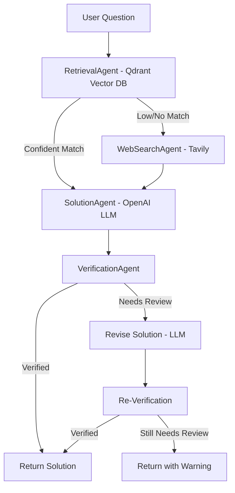

# MATh-RIX
# Mathematical AI Agent System: Project README

## Project Overview
This project implements a Human-in-the-Loop Mathematical Professor AI Agent. It leverages a vector database (Qdrant) for mathematical knowledge storage and retrieval, and supports advanced agent workflows for solving and explaining math problems.


---


### Agentic Workflow Overview

The agentic workflow in `math_agent_workflow.py` consists of the following steps:

1. **RetrievalAgent**: Searches the Qdrant vector database for similar math problems and solutions.
2. **WebSearchAgent**: If the knowledge base result is not confident, performs a web search (Tavily) for relevant solutions from trusted math domains.
3. **SolutionAgent**: Uses OpenAI's GPT-3.5-turbo to generate a step-by-step LaTeX-formatted solution, leveraging retrieved or web-searched information.
4. **VerificationAgent**: Independently solves the problem and checks the LLM's answer. If the answer is not verified, it revises and re-verifies the solution.
5. **Traceability**: Each agent logs its actions and decisions for transparency and debugging.

#### Schematic Workflow Diagram



**How the Workflow Runs**

- The workflow is coordinated by the `MathAgentWorkflow` class.
- The process is fully automated and agentic, with each agent operating independently and passing state to the next.
- If verification fails, the system attempts a single revision and re-verification.

---
## Running the System (with Docker for Qdrant)

### 1. Start Qdrant with Docker

```
docker run -p 6333:6333 -p 6334:6334 qdrant/qdrant
```

This will start Qdrant on `localhost:6333`.

### 2. Install Python Dependencies

```
pip install -r requirements.txt
```

### 3. Set Up Environment Variables

Create a `.env` file in the project root with your API keys:

```
OPENAI_API_KEY=sk-...
TAVILY_API_KEY=...
```

### 4. Ingest the Knowledge Base

```
python ingest_math_knowledge_base.py
```


### 5. (Option 1) Run the Agentic Workflow (CLI)

```
python math_agent_workflow.py
```

You will be prompted to enter a math question in the terminal. The system will retrieve, solve, verify, and (if needed) revise the answer, printing the full trace.

### 6. (Option 2) Use the Chainlit Web Interface

The project includes a Chainlit-based web UI for interactive Q&A, feedback, and prompt optimization.

To launch the Chainlit interface:

```
chainlit run math_agent_chainlit.py
```

Then open the provided local URL in your browser (usually http://localhost:8501 or similar).

**Features:**
- Ask math questions and get step-by-step LaTeX solutions
- Give feedback on answers (improves the agent over time)
- See when DSPy-optimized prompts are in use
- All agentic workflow steps (retrieval, web search, LLM, verification) are used under the hood

---

## Demo

[Watch the demo video](./Media/math_agent_workflow.mp4)

---

## Datasets Used in the Vector Database

The Qdrant vector database is populated with the following datasets:

- **GSM8K** ([gsm8k](https://huggingface.co/datasets/gsm8k), 'main' split):
  - Grade school math word problems and solutions.
  - Used for retrieval of step-by-step math reasoning at the elementary and middle school level.

- **Math-QA** ([rvv-karma/Math-QA](https://huggingface.co/datasets/rvv-karma/Math-QA), 'train' split):
  - Large-scale, multiple-choice math question dataset covering a wide range of topics and difficulty levels.
  - Each entry includes a question, options, and the correct answer label.
  - Used for retrieval of diverse math problems, including those with multiple-choice format.

All questions from both datasets are embedded and stored in Qdrant, with each entry tagged by its source ("gsm8k" or "math_qa").


---

## Possible Future Work
- Add advanced features (MCP, JEE Bench evaluation, etc)
---
_This README will be updated as the project progresses._
